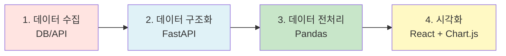
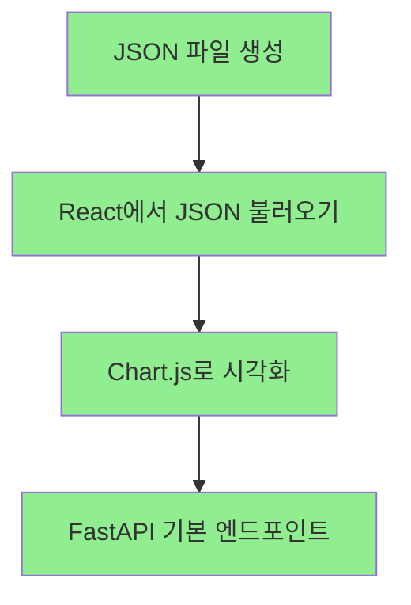
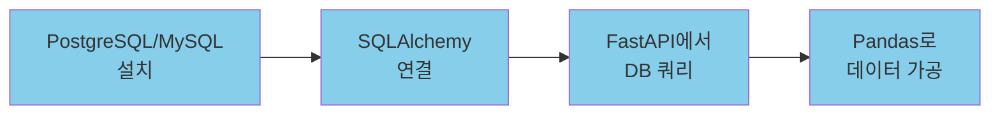

# 📚 학습 로드맵 및 개발 계획

> 실시간 대시보드 프로젝트를 위한 단계별 학습 및 구현 가이드

---

## 🎯 프로젝트 목표

React와 Python(Pandas, FastAPI)을 활용한 실시간 데이터 대시보드 구축

---

## 📊 데이터 분석 프로세스와 기술 스택 매핑



### 역할 분담

| 단계 | 기술 스택 | 역할 |
|------|----------|------|
| **1. 데이터 수집** | DB (PostgreSQL/MySQL) | 원본 데이터 저장 |
| **2. 구조화** | FastAPI | 클라이언트와 DB 사이의 중개자 (API 엔드포인트 제공) |
| **3. 전처리** | Pandas | 데이터 정제, 가공, 통계 계산 |
| **4. 시각화** | React + Chart.js/Recharts | 사용자에게 보여줄 UI 및 차트 렌더링 |

> [!NOTE]
> **EDA(탐색적 데이터 분석)**는 주로 Jupyter Notebook에서 진행하지만, 현재 단계에서는 필수가 아닙니다. 실제 서비스 구조를 먼저 익히는 것이 우선입니다.

---

## 🚀 학습 단계 (추천 순서)

### Phase 1: 기초 다지기 (현재 단계)



#### ✅ 즉시 진행
- [ ] `data.json` 샘플 파일 만들기
- [ ] React에서 `fetch`/`axios`로 JSON 불러오기
- [ ] Chart.js 또는 Recharts로 간단한 차트 그리기
- [ ] FastAPI 기본 엔드포인트 만들어보기 (`GET /api/data`)

**학습 포인트**: 데이터 흐름(Data Flow)을 명확히 이해하기

---

### Phase 2: Pandas 기본기 익히기


#### 📚 학습 예정
- [ ] Pandas 기본 문법 익히기
  - CSV/JSON 파일 읽기 (`pd.read_csv`, `pd.read_json`)
  - 데이터 필터링 (`df[df['column'] > value]`)
  - 기본 통계 (`df.describe()`, `df.groupby()`)
- [ ] Pandas로 데이터 가공 후 JSON 저장
- [ ] FastAPI + Pandas 연동 (가공된 데이터를 API로 서빙)

**예시 코드 구조**:
```python
import pandas as pd
from fastapi import FastAPI

app = FastAPI()

@app.get("/api/processed-data")
def get_processed_data():
    df = pd.read_csv("data.csv")
    filtered = df[df['status'] == 'active']
    result = filtered.to_dict(orient='records')
    return result
```

---

### Phase 3: 데이터베이스 연동



#### 🔧 학습 키워드
- [ ] SQL 기본 (SELECT, WHERE, JOIN)
- [ ] PostgreSQL 또는 MySQL 설치 및 설정
- [ ] SQLAlchemy/SQLModel로 DB 연결
- [ ] FastAPI에서 DB 쿼리 실행
- [ ] Docker로 DB 컨테이너 관리

**데이터 흐름**:
1. **DB**에서 데이터 가져오기
2. **Pandas**로 데이터 요리하기 (전처리)
3. **FastAPI**가 JSON으로 서빙
4. **React**가 차트로 시각화

---

### Phase 4: 고급 기능 (나중에)

#### 🔮 나중에 필요할 때
- [ ] Jupyter Notebook으로 EDA 실습
  - 데이터 탐색 및 패턴 분석
  - 시각화 프로토타이핑
- [ ] Docker Compose로 전체 시스템 컨테이너화
  - Frontend (React)
  - Backend (FastAPI)
  - Database (PostgreSQL)
- [ ] 실시간 데이터 스트리밍
  - WebSocket 연동
  - Server-Sent Events (SSE)
- [ ] 배포 및 운영
  - CI/CD 파이프라인
  - 모니터링 및 로깅

---

## 💡 Jupyter Notebook은 언제 필요한가?

### 필요한 경우
- 처음 받은 데이터의 구조와 패턴을 탐색할 때
- 복잡한 데이터 분석 로직을 실험할 때
- 일회성 보고서나 차트를 만들 때

### 현재는 불필요한 이유
- 명확한 목표(실시간 대시보드)가 있음
- FastAPI와 Pandas의 기본기를 먼저 다져야 함
- JSON 파일로 충분히 학습 가능

> [!IMPORTANT]
> **지금은 실제 서비스 구조를 익히는 게 우선입니다.** Jupyter는 나중에 복잡한 분석이 필요할 때 자연스럽게 필요성을 느끼게 될 것입니다.

---

## 📖 추천 학습 자료

### FastAPI
- [FastAPI 공식 문서](https://fastapi.tiangolo.com/)
- [FastAPI 튜토리얼 (한글)](https://fastapi.tiangolo.com/ko/)

### Pandas
- [Pandas 공식 문서](https://pandas.pydata.org/docs/)
- [10 Minutes to Pandas](https://pandas.pydata.org/docs/user_guide/10min.html)

### React + Chart.js
- [Chart.js 공식 문서](https://www.chartjs.org/)
- [Recharts 공식 문서](https://recharts.org/)

---

## 🎯 다음 단계

1. **JSON 파일로 프로토타입 만들기**
   - 샘플 데이터 생성
   - React에서 불러와 차트 렌더링

2. **Pandas 기본 실습**
   - CSV 파일 읽고 가공하기
   - 결과를 JSON으로 저장

3. **FastAPI 연동**
   - Pandas 가공 결과를 API로 제공
   - React에서 API 호출

---

**작성일**: 2026-02-15  
**프로젝트**: Realtime Dashboard  
**목표**: 단계적 학습을 통한 실전 역량 강화
