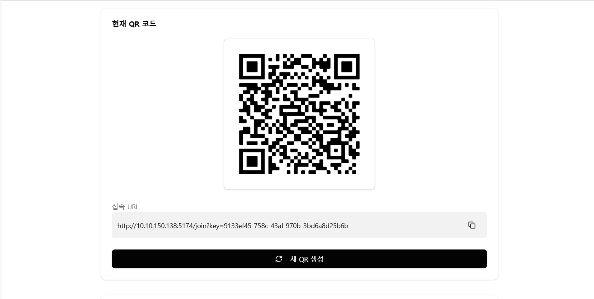
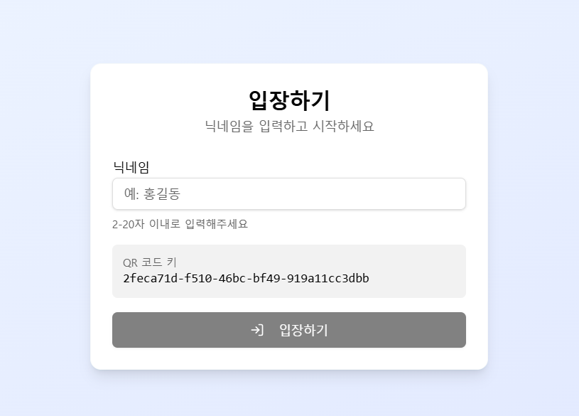
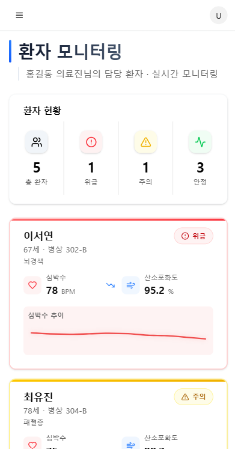
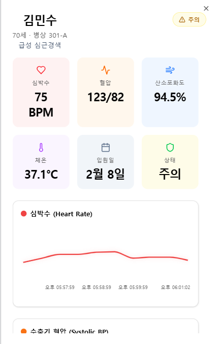

# 프로젝트 소개

**Real-time Dashboard**는 의료진이 각자 담당한 환자의 상태를 실시간으로 모니터링하고, QR 코드를 통해 간편하게 로그인 및 데이터에 접근할 수 있는 시스템을 구축하기 위한 아이디어 레벨의 컨셉 프로젝트 입니다.

## 주요 기능

1. **QR 로그인**: 의료진은 현장에서 분주한 현장에서 PC를 사용하기 어렵기 때문에 핸드폰이나 스마트 밴드를 이용하여 QR 코드를 스캔하여 간편한 로그인을 통해 시스템에 빠르게 접속할 수 있습니다.
보안을 위해 로그인한 각 의료진에 속한 담당 환자만 노출됩니다.
2. **실시간 환자 모니터링**: 대시보드에서 병실 내 환자들의 바이탈 사인 및 상태를 실시간으로 확인할 수 있습니다.
이때, 긴급 환자는 상위에 노출됩니다.
3. **환자 상세 정보**: 특정 환자를 선택하여 투약 기록, 검사 결과, 메모 등 상세 정보를 조회하고 관리할 수 있습니다.


## UI 플로우


- **스크린샷 1 (QR 접속)**:<br>
  
  <br>
  <br>
- **스크린샷 2 (간편 로그인)**: <br> 
  <br>
  <br>
- **스크린샷 3 (실시간 환자 모니터링)**: <br> 
  <br>
  <br>
- **스크린샷 4 (환자 상세)**: <br> 
  <br>
  <br>


## 시작하기

### 필수 조건

- Node.js 20.x 이상
- pnpm 9.x 이상

### 설치 및 실행

```bash
# pnpm 설치 (없는 경우)
npm install -g pnpm

# 의존성 설치
pnpm install

# 개발 서버 실행
pnpm dev
# (자동으로 --host 옵션이 적용되어 외부 접속이 가능합니다)
```

> [!IMPORTANT]
> **모바일 접속 주의사항**
> 
> 현재 프로젝트는 로컬 개발 서버에서 실행되므로, QR 코드를 통해 모바일 기기에서 접속하려면 **PC와 모바일 기기가 반드시 동일한 Wi-Fi 네트워크에 연결되어 있어야 합니다.**

브라우저에서 `http://localhost:5173` 또는 터미널에 표시된 `Network URL`로 접속하세요.

## 프로젝트 구조

```text
src/
├── features/             # 기능별 모듈
├── routes/               # 페이지 라우트 (TanStack Router)
├── components/           # 공통 컴포넌트
│   ├── ui/               # ShadcnUI 기본 컴포넌트
│   └── layout/           # 레이아웃 (Layout, Sidebar, Header)
├── hooks/                # 커스텀 훅
├── lib/                  # 유틸리티 (axios, utils 등)
├── stores/               # Zustand 상태
├── styles/               # 글로벌 스타일
└── types/                # 타입 정의
```

## 라이선스 (License)

이 프로젝트는 **MIT 라이선스**를 따릅니다.

Copyright (c) 2026 Yoon SangHwan
