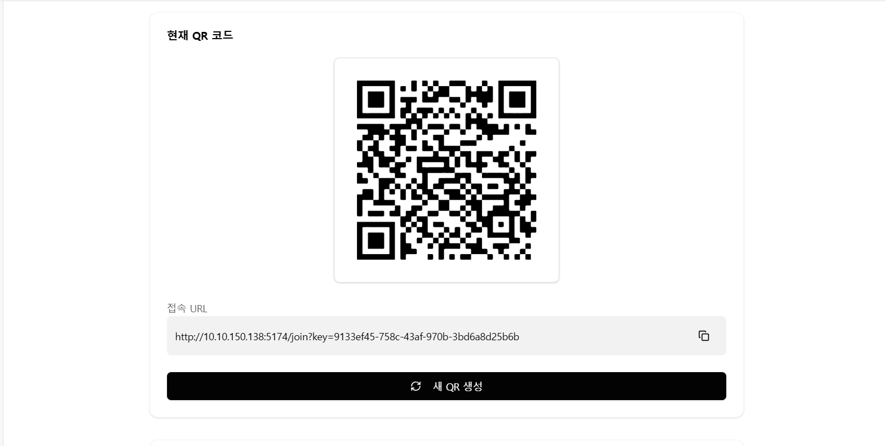
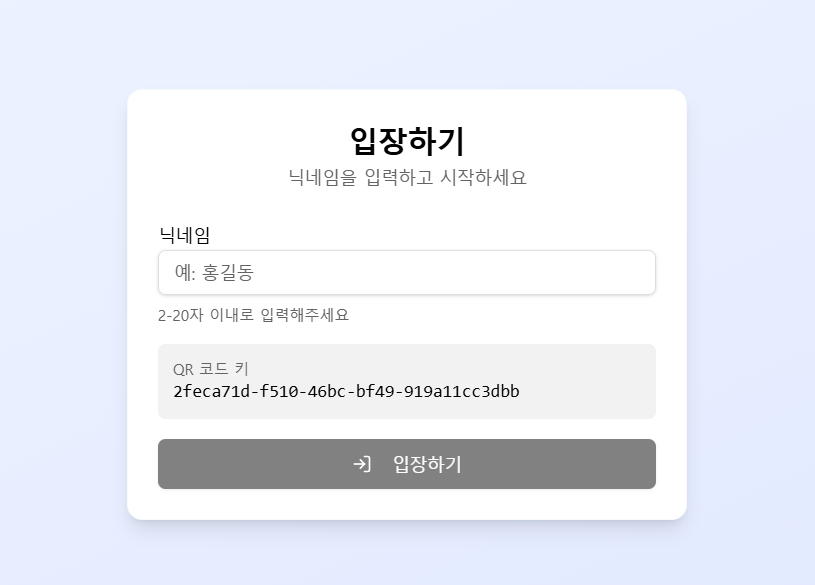
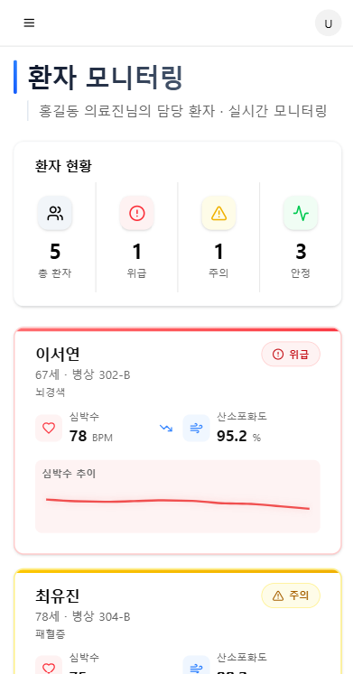
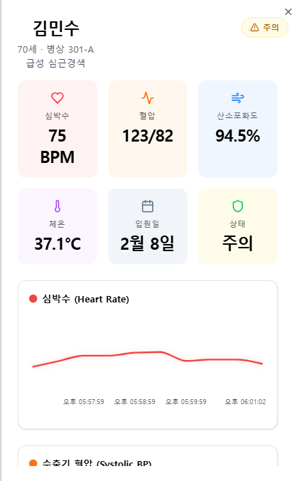

# 🏥 Realtime Dashboard

[](https://react.dev/)
[](https://www.typescriptlang.org/)
[](https://vitejs.dev/)
[](https://tailwindcss.com/)
[](https://fastapi.tiangolo.com/)
[](https://pandas.pydata.org/)
[](#-라이선스-license)

실시간 환자 모니터링을 위한 **의료용 대시보드 시스템**입니다.
프론트엔드는 React와 Vite로 구축되었으며, 백엔드는 FastAPI, 데이터 분석은 Pandas로 구성되어 있습니다.

## 🚀 프로젝트 목적

> **"직관적인 데이터 시각화로 의료진의 의사결정을 지원합니다."**
>
> 본 프로젝트는 병실 내 환자들의 상태를 실시간으로 모니터링하고, 담당 간호사가 효율적으로 환자를 관리할 수 있도록 돕는 것을 목표로 합니다.
> 빠르고 안정적인 데이터 통신과 직관적인 UI/UX를 제공합니다.
>
> **💡 개발 취지**
>
> 본 프로젝트는 실제 데이터베이스를 구축하는 대신 **React(Frontend) - FastAPI(Backend) - Pandas(Data Processing)** 간의 유기적인 데이터 흐름을 실험하고 검증하는 데에 초점을 맞추었습니다.
> 특히 헬스케어 데이터(환자 정보)를 다루는 로직을 구현함에 있어, 복잡한 인프라 설정 없이 코드 레벨의 **Mock Data**를 활용하여 개발 효율성을 높이고 파이프라인 구축에 집중했습니다.

## ✨ 핵심 기능

- **QR 로그인 (Concept)**:
  - 의료진이 분주한 현장에서 모바일 기기나 스마트 밴드로 QR 코드를 스캔하여 빠르게 시스템에 접속할 수 있는 간편 로그인 기능을 제공합니다.
  - 보안을 위해 로그인한 의료진에게 배정된 담당 환자 목록만 선별적으로 노출합니다.
- **실시간 환자 모니터링**:
  - 활력 징후(Vital Signs) 및 환자 상태 실시간 조회.
- **담당 간호사 배정 시스템**:
  - 간호사별 담당 환자 필터링 및 관리.
- **데이터 기반 백엔드**:
  - Pandas를 활용한 효율적인 환자 데이터 관리 및 조회.
- **안정적인 API 통신**:
  - FastAPI 기반의 RESTful API 제공 및 타입 안전한 클라이언트 연동.

## 🛠 기술 스택

### Frontend
| 분류 | 기술 |
| :--- | :--- |
| **Framework** | [React 18](https://react.dev/) + [TypeScript](https://www.typescriptlang.org/) |
| **Build Tool** | [Vite 5](https://vitejs.dev/) |
| **Styling** | [Tailwind CSS](https://tailwindcss.com/) + Shadcn UI |
| **State Mgt** | React Context API |

### Backend
| 분류 | 기술 |
| :--- | :--- |
| **Framework** | [FastAPI](https://fastapi.tiangolo.com/) |
| **Data Processing** | [Pandas](https://pandas.pydata.org/) |
| **Server(Execution Engine)** | [Uvicorn](https://www.uvicorn.org/) |

### Data Management (Mock Data)
실제 DB 대신 Python 리스트 형태의 목 데이터를 사용하여 서버 실행 시마다 가상 데이터를 생성합니다.

- **파일 경로**: `backend/app/data/mock_data.py`
- **포함 내용**: 한국인 성/이름 조합, 주요 진단명 리스트 (예: 급성 심근경색, 뇌경색 등)
- **작동 방식**: `patient_service.py`에서 위 데이터를 `import`하여 Pandas DataFrame으로 변환 후 REST API로 서빙

## 📱 UI 플로우

상태 변화에 따른 직관적인 UI 흐름을 제공합니다.

<div align="center">
  <table style="width: 100%; border-collapse: collapse; border: none;">
    <tr style="border: none;">
      <td style="width: 50%; border: none; padding: 10px; text-align: center; vertical-align: top;">
        <strong>1. QR 접속</strong><br><br>
        
      </td>
      <td style="width: 50%; border: none; padding: 10px; text-align: center; vertical-align: top;">
        <strong>2. 간편 로그인</strong><br><br>
        
      </td>
    </tr>
    <tr style="border: none;">
      <td style="width: 50%; border: none; padding: 10px; text-align: center; vertical-align: top;">
        <br><strong>3. 실시간 모니터링</strong><br><br>
        
      </td>
      <td style="width: 50%; border: none; padding: 10px; text-align: center; vertical-align: top;">
        <br><strong>4. 환자 상세 정보</strong><br><br>
        
      </td>
    </tr>
  </table>
</div>

> [!IMPORTANT]
> **모바일 접속 주의사항**
> 
> 현재 프로젝트는 로컬 개발 서버에서 실행되므로, QR 코드를 통해 모바일 기기에서 접속하려면 **PC와 모바일 기기가 반드시 동일한 Wi-Fi 네트워크에 연결되어 있어야 합니다.**

## 📂 프로젝트 구조

```text
realtime-dashboard/
├── frontend/             # React 프론트엔드
│   ├── src/
│   │   ├── components/   # UI 컴포넌트
│   │   ├── lib/          # API 클라이언트 및 유틸리티
│   │   ├── routes/       # 페이지 라우팅
│   │   └── types/        # TypeScript 타입 정의
│   └── ...
├── backend/              # FastAPI 백엔드
│   ├── app/
│   │   ├── api/          # API 엔드포인트
│   │   ├── models.py     # Pydantic 모델
│   │   └── services/     # 비즈니스 로직 (Pandas 활용)
│   ├── venv/             # 파이썬 가상환경
│   └── run_server.bat    # 서버 실행 스크립트
└── ...
```

## 🚀 시작하기

### 1. 백엔드 실행
`backend` 폴더의 `run_server.bat` 파일을 더블 클릭하여 복잡한 cli 없이 간편하게 서버를 실행할 수 있습니다.

```bash
cd backend
# 가상환경 활성화 (Windows)
source venv/Scripts/activate
# 서버 실행
python -m uvicorn main:app --reload
```

### 2. 프론트엔드 실행
새로운 터미널을 열고 다음을 실행합니다.

```bash
cd frontend
pnpm install
pnpm dev
```

## 📞 연락처 (Contact)

- **Phone**: 010-2835-7421
- **Email**: sadkop00@gmail.com

## 📄 라이선스 (License)

Copyright (c) 2026 **Yoon SangHwan** All Rights Reserved.

### ⚠️ 저작권 및 이용 안내

본 프로젝트의 `package.json`에 명시된 `"license": "UNLICENSED"`는 별도의 오픈소스 라이선스가 부여되지 않았음을 의미합니다. 이는 라이선스가 없어 자유롭게 이용 가능하다는 뜻이 아니라, **해당 소프트웨어에 대한 모든 권리가 저작권자에게 귀속되어 있음**을 나타냅니다.

- **무단 복제 및 배포 금지**: 저작권자의 서면 동의 없이 본 코드의 전체 또는 일부를 무단으로 복제, 배포, 수정하는 행위는 엄격히 금지됩니다.
- **학습 목적의 참조**: 교육 및 학습 목적의 단순 코드 참조는 환영하나, 이를 활용한 상업적 이용이나 2차 저작물 생성은 불가능합니다.
- **이용 문의**: 상업적 활용 또는 프로젝트 협업에 관한 문의는 아래의 연락처를 통해 협의해 주시기 바랍니다.

> **Note**: 본 프로젝트는 저작권법의 보호를 받는 독자적인 저작물이며, 무단 사용 시 법적 책임을 물을 수 있습니다.
